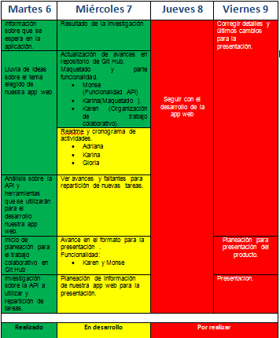

**APP TRAILERAMA**

#OBJETIVO

Crear una aplicación para ver los trailers de las películas que saldrán próximamente en el cine, con las siguientes opciones:

- Hacer la búsqueda por medio de un input con filtrado.
- Agendar la fecha en la que el usuario la quiere ver.
- Guardar las películas que el usuario prefiera.
- Compartir en redes sociales e incluso poder comprar entradas para ver la película elegida.

*En este primer alcance, se cubrirán las primeras necesidades de poder buscar las películas y guardarlas*

#FLUJO DEL PROGRAMA

Se trabajará primero con la versión móvil.

En la parte del header se mostrará el logo, y un menú desplegable, que tendrá las opciones de inciar y/o cerrar sesión, películas guardadas y agenda.

Para poder ingresar a la aplicación el usuario deberá ingresar por medio de su correo, para esto se va a requerir una autentificación utilizando Firebase, y una vez que ingrese, se mostrará un buscador para poder filtrar con el título de la película, y también una lista de todas las películas (mostrando la imagen de la película, título, categoría y raiting).

Al darle click en alguna de las imágenes, se abrirá un modal en el que se mostrará el trailer de la película y con botones para agendar, guardar y compartir. Y la opción de cerrar el modal para poder regresar al listado de las películas.

#API

Usaremos la API The Movie DB, ya que contiene los datos que nuestra aplicación necesita.
Y se tiene planeado usar también la API Google Calendar, para la parte en la que el usuario podrá agendar el día en le que quiere ver la película.

#RESULTADOS UX

- El 70% de los encuestados buscan películas utilizando aplicaciones, el resto lo hace en paginas especializadas o directamente en el cine.
- 54% de los encuestados buscan sus películas por género contra 46% que las busca por título.
- Al 70% les gustaría recibir notificaciones de sus peliculas agendadas en la aplicación una vez por semana.
- Al 60% le gustaria poder compartir sus películas favoritas en redes sociales.
- El 87% quisiera poder invitar a otra persona a ver las películas que agende
- El 94% estaría interesado en ver en qué cines está disponible su película favorita
- Al 100% le parecería muy útil poder comprar boletos para asistir a la función a través de ésta aplicación.

Gracias a estas estadísticas concluimos que:

1.- Debemos darle prioridad a los filtros por género y nombre para la búsqueda de películas.

En los siguientes alcances del desarrollo de la aplicación desarollaremos las siguientes funciones:

2.- La aplicacion agendará fecha y hora para  que el usuario vea una película que sea de su interés y notificará al usuario una vez por semana.

3.-Tendrá una opción que permitirá al usuario invitar a otros usuarios a sus funciones reservadas  y compartir en redes sociales sus trailers favoritos.

4.- Mostraremos los cines en los que está disponible la cinta y tendremos una opción para compra de boletos.

#CRONOGRAMA

